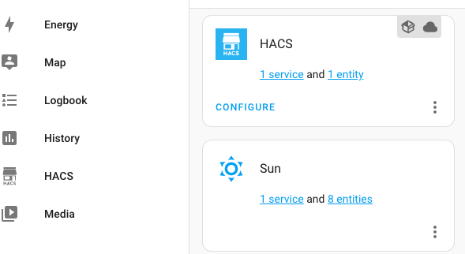
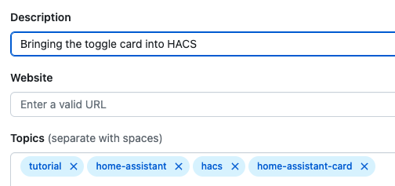
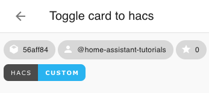
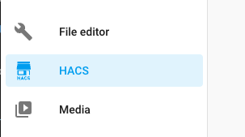
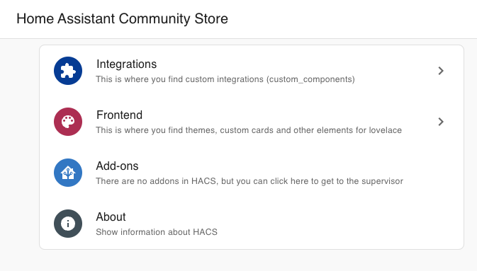
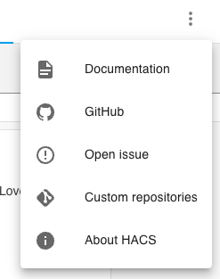
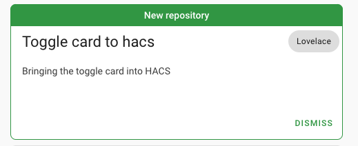
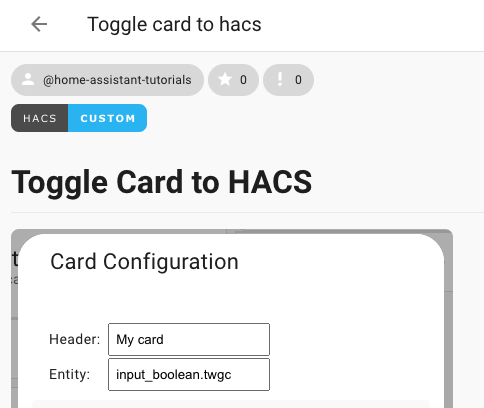
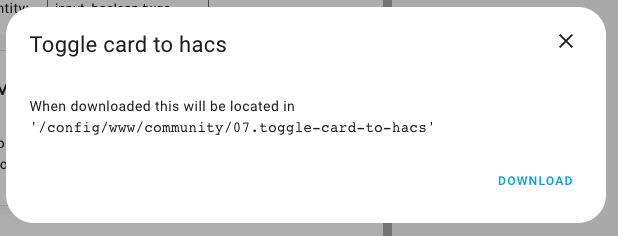
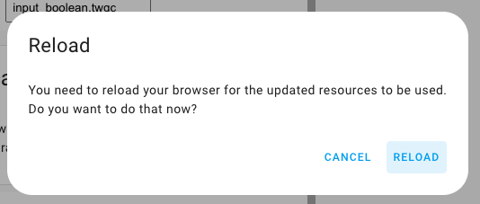

[](https://github.com/hacs/integration)

# Toggle Card to HACS


Bringing the toggle card to HACS

***

* @published: May 2023
* @author: Elmar Hinz
* @name: `toggle-card-to-hacs`
* @id: `tcth`

You learn:

* how to install HACS in the development environment
* how to layout the Github repository for a custom HACS card
* how to use the HACS repository

## Goal

The goal of this tutorial is to bring you card to HACS by preparing a repository
on Github according to the requirements of HACS. It will be a custom repository.
We don't register it as a default repository.

## Prerequisites

* tutorial 06: toggle with graphical configuration
* you have an account on github
* you have HACS installed into homeassistant
* you know how to register `card.js` as a resource
* you know how to create the helper entity of type boolean aka toggle
* you know how to add and edit a card
* you know how to reload `card.js` and dashboard after editing

In doubt revisit tutorial 02 and 04.

## Setup

You can directly download the tutorial as a HACS repository. Hence, there
is no need to install it into `wwww/tutor` like in the previous tutorials. It
may even cause conflicts.

Name the helper entity `tcth` this time or just use previous one.

### Installing HACS in the development environment

If you look for a quick solution you can do this tutorial by using an existings
HACS installation of your life system. If you want to dig deeper you can install
HACS into the development-environment that you have set up in tutorial 01.

It is easy to do, as vscode gives you direct access to files and shell. For
those that have never installed HACS I describe it within this environment. For
the most steps of the installation I refer to the HACS homepage, which describes
the requirements and steps in detail.

The starting point of the installation is here with
[Prerequisites](https://hacs.xyz/docs/setup/prerequisites). You can skip the
setup of *my integration* within vscode. I will not work here anyway. Follow
along the setup, do the given steps and always click *next* until the setup is
done.

In the download page select the setup for *Core*:

```js
wget -O - https://get.hacs.xyz | bash -

```

Open a shell in vscode to execte it.


[ ... ]


As suggestet restart *Home Assistant*, so that everthing gets loaded so far.
Kill the terminal by clicking the trash icon. Then restart *Home Assistant*.
See tutorial 01 to recap how to do it.

Follow along the instruction. Do the steps with the Github device ativation. If
everything works as expected, *HACS* will show up in the menu on the left.



## Code

The code `cardjs` is the same as in the previous tutorial. All names and ids
have been adjusted.

## HACS

The requirements of HACS are [documented
here](https://hacs.xyz/docs/publish/start).

Some requirements are stored as files into the repository.  Other requirements
like *description*, *topics* and *version* are edited with the tools of your
github repository.

### The `hacs.json` file

This is the configuration file of the HACS repository.

```js
{
    "name": "Simple Toggle Card",
    "render_readme": true,
    "filename": "card.js"
    "content_in_root": true
  }
```

The `name` is the minimal requirement of HACS. It is displayed in the frontend.
`render_readme` tells HACS to render `README.md` instead of `info.md` in the
frontend. `filename` is the name of the card's file we want to ship.

`content_in_root` informs HACS not to expect a `dist/` directory.  If you run a
toolchain to generate from a `src/` directory you will likely use a `dist/`
directory which is the default location.

### The `README.md` file

The README by chance is the file containing this turial. HACS points to
[this address] (https://github.com/matiassingers/awesome-readme) for suggestions
how to do a good README.

A badge in the *README* advertises the repository as a HACS repository. The code
string is given on the page with the documentation.

```js
[](https://github.com/hacs/integration)
```

### Description and topics

The HACS documentation suggestes to add a discription and topics by the
administration interface of Github.



The description is displayed in the frontend. I didn't find that the topics
would be used somewhere.

### Version

Bei default the frontend will display the latest git hash of the main branch.



If you want to show a version number instead the HACS documentation advises
to create a tag with the version PLUS making a realse of it.
As this tutorials are not versionized, I don't show this.

## Using the custom card

Assuming you have HACS installed an you have first experiences how to use it.



Open HACS in the menu on the left.



Select frontend in the list.



In the upper right hand corner select custom repositories.


Insert the *URL* and select the catergory *Lovelace*. The *URL* may be the *URL* of
this tutorial or your fork of it i.e. `https://github.com/home-assistant-tutorials/07.toggle-card-to-hacs`.



After clicking *ADD* the card is registered as a new repository.



Select it and this *README* will be displayed.


At the lower right hand corner, there is the download button.



A download popup asks for confirmation and tells you the target directory.



After download you have to reload the browser.


Now change to your dashboard to add a card as usual. You find the new
card in the thumbnails selection.